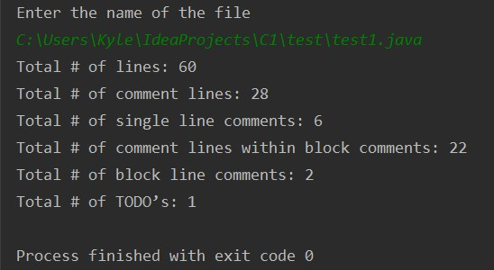
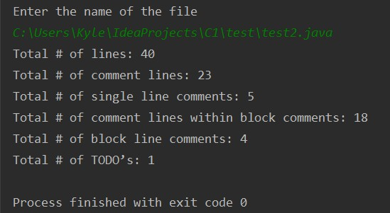
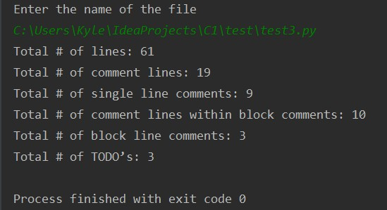
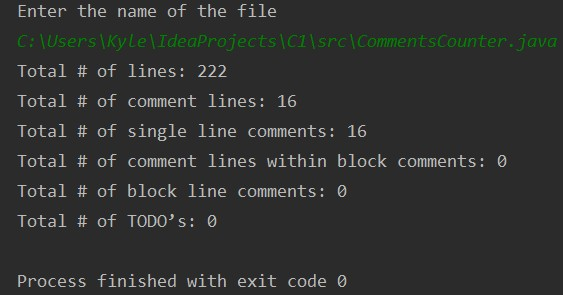

# C1

Requirements:
1) When a file is checked in, scan the file to count the total number of lines.
2) Scan the file to identify comments and count the total lines of comments in the file.
3) After identifying the lines of comments, scan to segregate the total number of single line comments and the total number of multi-line comments.
4) Any line of code that has a trailing comment should be counted both as lines of code and also a comment line.
5) Finally, from all the comments in the file, identify and count the total number of TODOs.
6) Please note, that the file that is being checked in could be any valid program file. Files checked in without an extension can be ignored. You can also ignore file names that start with a ‘.’.

Supported languages:
- Java
- Python
- C
- C++
- Javascript

Sample outputs:
1) test file: <a href="test/test1.java"> test 1 </a> 
output:  
2) test file: <a href="test/test2.java"> test 2 </a> 
output:  
3) test file: <a href="test/test3.py"> test 3 </a> 
output:  
4) test file: <a href="src/CommentsCounter.java"> the main class of this project! </a> 
output:  
